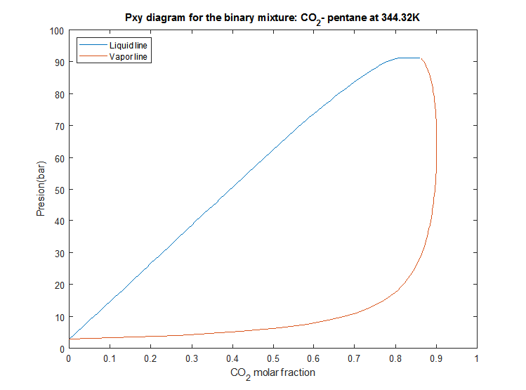

# Pxy diagram for chemical mixtures
This program compute the composition of the liquid and vapor phase of a mixture using the Peng-robinson EOS and the Van Der Waals mixing rules. The computed data is presented in a Pxy diagram for a single component.

This is an object oriented implementation using MATLAB code.
The equations utilized for the calculations are from the textbook FUNDAMENTALS OF CHEMICAL ENGINEERING THERMODINAMICS, Themis Matsoukas.

Binary interaction parameters for the CO2/n-pentane mixture from Sandler pag. 565. 
The computation gives a better aproximation to the real mixture properties if experimental binary parameters are used for the selected temperature.

For the CO_2 - n-pentane mixture produce the following graph:

